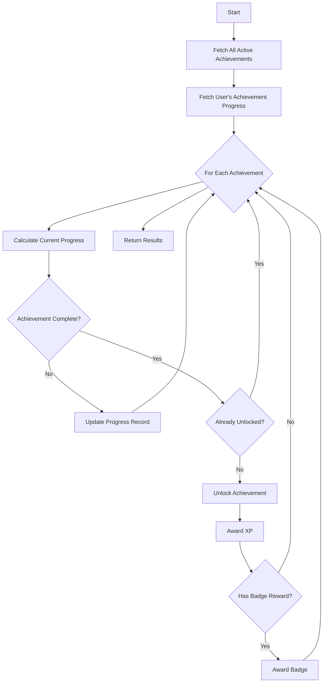
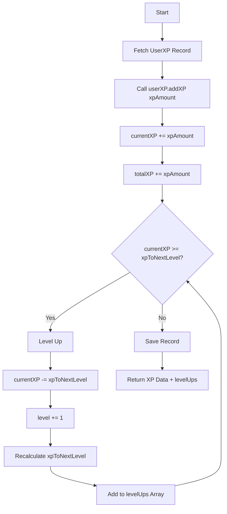

# ⚙️ ACHIEVEMENT ENGINE - ARCHITECTURE & LOGIC FLOW

## 📋 **OVERVIEW**

The Achievement Engine is a **singleton service** that manages all achievement evaluation, unlocking, XP awarding, badge distribution, and milestone tracking. It serves as the central orchestrator for the gamification system.

**File Location:** `server/services/achievementEngine.js`

---

## 🏗️ **ARCHITECTURE**

### **Design Pattern: Singleton**

```javascript
class AchievementEngine {
  constructor() {
    if (AchievementEngine.instance) {
      return AchievementEngine.instance
    }
    AchievementEngine.instance = this
  }
}

export default new AchievementEngine()
```

**Why Singleton?**
- **Single Instance:** Ensures only one engine exists
- **Shared State:** Consistent caching and state management
- **Memory Efficient:** No duplicate instances
- **Easy Import:** `import achievementEngine from '@/services/achievementEngine.js'`

---

## 🔧 **CORE METHODS**

### **1. triggerFromGameEvent()**

**Purpose:** Entry point for all game events  
**Usage:** Called from game controllers after events complete

```javascript
async triggerFromGameEvent(userId, eventType, eventData)
```

**Parameters:**
- `userId` (ObjectId) - User performing the action
- `eventType` (String) - Type of event: `puzzle_completed`, `classic_completed`, `time_trial_completed`, `queen_placed`, `move_made`
- `eventData` (Object) - Event-specific data

**Event Data Structures:**

**puzzle_completed:**
```javascript
{
  puzzleId: String,
  timeTaken: Number,      // seconds
  movesCount: Number,
  hintsUsed: Number,
  stars: Number,          // 0-3
  boardSize: Number
}
```

**classic_completed:**
```javascript
{
  boardSize: Number,
  timeTaken: Number,
  movesCount: Number,
  hintsUsed: Number
}
```

**time_trial_completed:**
```javascript
{
  score: Number,
  timeTaken: Number,
  puzzlesSolved: Number
}
```

**queen_placed / move_made:**
```javascript
{
  boardSize: Number,
  position: Object        // { row, col }
}
```

**Flow:**
1. Receive event + data
2. Call `getUserStats(userId)` to aggregate stats
3. Call `checkAchievements(userId, userStats)`
4. Call `checkMilestones(userId, userStats)`
5. Return updated XP, achievements, badges

---

### **2. checkAchievements()**

**Purpose:** Evaluate all active achievements for a user

```javascript
async checkAchievements(userId, userStats)
```

**Parameters:**
- `userId` (ObjectId) - User to check
- `userStats` (Object) - Aggregated user statistics

**Logic Flow:**



**Returns:**
```javascript
{
  newAchievements: [
    { achievementId, name, xpAwarded, badgeAwarded }
  ],
  updatedProgress: [
    { achievementId, progress, isCompleted }
  ]
}
```

---

### **3. calculateProgress()**

**Purpose:** Calculate current progress for a specific achievement

```javascript
calculateProgress(achievement, userStats)
```

**Parameters:**
- `achievement` (Object) - Achievement definition
- `userStats` (Object) - User statistics

**Requirement Type Mapping:**

| Requirement Type | Data Source | Calculation |
|-----------------|-------------|-------------|
| `games_completed` | `userStats.gamesCompleted` | Direct value |
| `puzzles_completed` | `userStats.puzzlesCompleted` | Direct value |
| `queens_placed` | `userStats.queensPlaced` | Direct value |
| `total_moves` | `userStats.totalMoves` | Direct value |
| `solve_time` | `userStats.bestSolveTime` | Minimum time |
| `puzzle_stars` | `userStats.totalStars` | Direct value |
| `zero_hints` | `userStats.zeroHintGames` | Count games with hintsUsed = 0 |
| `streak_days` | `userStats.currentStreak` | Consecutive login days |
| `level_reached` | `userStats.currentLevel` | Current level |
| `perfect_solve` | `userStats.perfectSolves` | Count games with no invalid moves |
| `efficiency` | `userStats.efficiency` | (optimal moves / actual moves) × 100 |

**Returns:** `Number` - Current progress value

---

### **4. evaluateRequirement()**

**Purpose:** Boolean evaluation of requirement completion

```javascript
evaluateRequirement(currentValue, targetValue, operator)
```

**Parameters:**
- `currentValue` (Number) - User's current progress
- `targetValue` (Number) - Required value for completion
- `operator` (String) - Comparison operator

**Operators:**

| Operator | Logic | Example |
|----------|-------|---------|
| `gte` | `current >= target` | 50 >= 50 → true |
| `lte` | `current <= target` | 30 <= 60 → true |
| `eq` | `current === target` | 3 === 3 → true |
| `gt` | `current > target` | 51 > 50 → true |
| `lt` | `current < target` | 29 < 30 → true |

**Returns:** `Boolean` - true if requirement met, false otherwise

---

### **5. unlockAchievement()**

**Purpose:** Award achievement to user and create record

```javascript
async unlockAchievement(userId, achievement, progress)
```

**Parameters:**
- `userId` (ObjectId) - User receiving achievement
- `achievement` (Object) - Achievement definition
- `progress` (Number) - Final progress value (should equal requirementValue)

**Actions:**
1. Check if achievement already unlocked
2. Create `UserAchievement` record:
   ```javascript
   {
     userId,
     achievementId,
     progress: achievement.requirementValue,
     isCompleted: true,
     completedAt: new Date(),
     notificationShown: false
   }
   ```
3. Add achievement to notification queue
4. Return achievement data

**Returns:**
```javascript
{
  achievementId,
  name,
  xpAwarded: achievement.rewardXP,
  pointsAwarded: achievement.rewardPoints,
  badgeId: achievement.rewardBadgeId || null
}
```

---

### **6. awardXP()**

**Purpose:** Add XP to user and handle level-ups

```javascript
async awardXP(userId, xpAmount)
```

**Parameters:**
- `userId` (ObjectId) - User receiving XP
- `xpAmount` (Number) - Amount of XP to award

**Logic Flow:**



**Returns:**
```javascript
{
  currentXP,
  totalXP,
  level,
  xpToNextLevel,
  levelProgress,
  levelUps: [2, 3]  // Array of new levels reached
}
```

---

### **7. awardBadge()**

**Purpose:** Award badge to user

```javascript
async awardBadge(userId, badgeId)
```

**Parameters:**
- `userId` (ObjectId) - User receiving badge
- `badgeId` (String) - Badge identifier

**Actions:**
1. Check if badge already earned
2. Fetch badge definition
3. Create `UserBadge` record:
   ```javascript
   {
     userId,
     badgeId,
     earnedAt: new Date(),
     isEquipped: false,
     notificationShown: false
   }
   ```
4. Add badge to notification queue
5. Return badge data

**Returns:**
```javascript
{
  badgeId,
  name,
  tier,
  icon
}
```

---

### **8. checkMilestones()**

**Purpose:** Evaluate milestone achievements

```javascript
async checkMilestones(userId, userStats)
```

**Parameters:**
- `userId` (ObjectId) - User to check
- `userStats` (Object) - Aggregated statistics

**Milestone Trigger Types:**
- `level` - User level reached
- `puzzles_solved` - Total puzzles solved
- `queens_placed` - Total queens placed
- `total_moves` - Total moves made
- `achievements_unlocked` - Total achievements unlocked

**Flow:**
1. Fetch all active milestones
2. Fetch user's milestone progress
3. For each milestone:
   - Check if trigger condition met
   - If met and not already earned:
     - Award milestone
     - Award XP/points/badge
     - Create `UserMilestone` record
4. Return awarded milestones

**Returns:**
```javascript
{
  newMilestones: [
    { milestoneId, name, rewardXP, rewardPoints }
  ]
}
```

---

### **9. getUserStats()**

**Purpose:** Aggregate user statistics from multiple sources

```javascript
async getUserStats(userId)
```

**Parameters:**
- `userId` (ObjectId) - User to aggregate stats for

**Data Sources:**

| Stat | Source Model | Query |
|------|-------------|-------|
| `gamesCompleted` | GameHistory | `count({ userId, completed: true })` |
| `puzzlesCompleted` | PuzzleHistory | `count({ userId, completed: true })` |
| `queensPlaced` | GameSession | `sum(queensPlaced)` |
| `totalMoves` | GameSession | `sum(movesCount)` |
| `bestSolveTime` | GameHistory | `min(timeTaken)` |
| `totalStars` | PuzzleHistory | `sum(stars)` |
| `zeroHintGames` | GameHistory | `count({ hintsUsed: 0 })` |
| `currentStreak` | UserLoginHistory | Calculate consecutive days |
| `currentLevel` | UserXP | `level` field |
| `perfectSolves` | GameHistory | `count({ invalidMoves: 0 })` |
| `efficiency` | GameHistory | Average efficiency score |

**Returns:**
```javascript
{
  gamesCompleted: 15,
  puzzlesCompleted: 7,
  queensPlaced: 120,
  totalMoves: 350,
  bestSolveTime: 28,
  totalStars: 18,
  zeroHintGames: 5,
  currentStreak: 7,
  currentLevel: 5,
  perfectSolves: 3,
  efficiency: 87.5
}
```

---

## 🔄 **EVENT FLOW DIAGRAMS**

### **Complete Achievement Flow**

```
┌─────────────────┐
│  Game Action    │
│  (e.g., puzzle  │
│  completed)     │
└────────┬────────┘
         │
         ▼
┌─────────────────────────────────────┐
│  Game Controller                    │
│  (puzzleController.complete)        │
└────────┬────────────────────────────┘
         │
         ▼
┌─────────────────────────────────────┐
│  Achievement Engine                 │
│  .triggerFromGameEvent()            │
└────────┬────────────────────────────┘
         │
         ├──► getUserStats(userId)
         │    └──► Aggregates stats from DB
         │
         ├──► checkAchievements(userId, stats)
         │    ├──► calculateProgress()
         │    ├──► evaluateRequirement()
         │    └──► unlockAchievement()
         │         ├──► awardXP()
         │         └──► awardBadge()
         │
         └──► checkMilestones(userId, stats)
              └──► Award milestone rewards
         │
         ▼
┌─────────────────────────────────────┐
│  Return to Controller               │
│  { achievements, xp, badges }       │
└────────┬────────────────────────────┘
         │
         ▼
┌─────────────────────────────────────┐
│  HTTP Response to Frontend          │
└─────────────────────────────────────┘
```

---

### **XP Awarding Flow**

```
Achievement Unlocked
         │
         ▼
┌─────────────────────────────────────┐
│  achievementEngine.awardXP()        │
│  (xpAmount = 150)                   │
└────────┬────────────────────────────┘
         │
         ▼
┌─────────────────────────────────────┐
│  UserXP.addXP(150)                  │
│  currentXP: 50 → 200                │
│  totalXP: 450 → 600                 │
└────────┬────────────────────────────┘
         │
         ▼
     ┌───┴────┐
     │ Check  │
     │ Level  │
     │  Up?   │
     └───┬────┘
         │
    ┌────┴────┐
    │  Yes    │  No
    │         │  
    ▼         ▼
Level Up    Save &
Process     Return
    │
    ├──► currentXP -= xpToNextLevel
    ├──► level += 1
    ├──► Calculate new xpToNextLevel
    ├──► Add to levelUps array
    └──► Loop back to check again
```

---

## 🧪 **TESTING SCENARIOS**

### **Test 1: Single Achievement Unlock**

**Input:**
```javascript
achievementEngine.triggerFromGameEvent(
  userId,
  'classic_completed',
  { boardSize: 8, timeTaken: 45, movesCount: 15, hintsUsed: 0 }
)
```

**Expected Flow:**
1. getUserStats() → Fetch stats
2. checkAchievements() → Evaluate all achievements
3. Achievement "Zero Hint Hero" → Progress 1/1 → Complete
4. unlockAchievement() → Create UserAchievement
5. awardXP(100) → Add 100 XP
6. Return: `{ newAchievements: [{ achievementId: 'zero_hint_hero', xpAwarded: 100 }] }`

---

### **Test 2: Achievement with Badge**

**Input:**
```javascript
achievementEngine.triggerFromGameEvent(
  userId,
  'queen_placed',
  { boardSize: 8, position: { row: 0, col: 0 } }
)
// Assume this is the 50th queen placed
```

**Expected Flow:**
1. getUserStats() → queensPlaced = 50
2. checkAchievements() → Evaluate "Sharp Thinker"
3. Progress: 50 >= 50 → Complete
4. unlockAchievement() → Create UserAchievement
5. awardXP(50) → Add 50 XP
6. rewardBadgeId = 'bronze_solver' → Call awardBadge()
7. awardBadge('bronze_solver') → Create UserBadge
8. Return: `{ newAchievements: [{ achievementId: 'sharp_thinker', xpAwarded: 50, badgeAwarded: 'bronze_solver' }] }`

---

### **Test 3: Multiple Level-Ups**

**Input:**
```javascript
achievementEngine.awardXP(userId, 2700)
// User at Level 1, 0 XP
```

**Expected Flow:**
1. addXP(2700)
2. currentXP = 0 + 2700 = 2700
3. xpToNextLevel = 200 (Level 1 → 2)
4. **Level Up 1:** currentXP = 2700 - 200 = 2500, level = 2
5. xpToNextLevel = 450 (Level 2 → 3)
6. **Level Up 2:** currentXP = 2500 - 450 = 2050, level = 3
7. xpToNextLevel = 800 (Level 3 → 4)
8. **Level Up 3:** currentXP = 2050 - 800 = 1250, level = 4
9. xpToNextLevel = 1250 (Level 4 → 5)
10. **Level Up 4:** currentXP = 1250 - 1250 = 0, level = 5
11. xpToNextLevel = 1800 (Level 5 → 6)
12. Exit loop (currentXP < xpToNextLevel)
13. Return: `{ level: 5, currentXP: 0, levelUps: [2, 3, 4, 5] }`

---

### **Test 4: Milestone Unlock**

**Input:**
```javascript
achievementEngine.checkMilestones(userId, userStats)
// userStats.currentLevel = 5
```

**Expected Flow:**
1. Fetch milestones
2. Milestone "Level 5 Reached" → triggerType: 'level', triggerValue: 5
3. currentLevel (5) >= triggerValue (5) → Complete
4. Check if already earned → No
5. Create UserMilestone record
6. Award XP: 100 XP
7. Return: `{ newMilestones: [{ milestoneId: 'level_5', rewardXP: 100 }] }`

---

## 🎯 **PERFORMANCE OPTIMIZATIONS**

### **1. Caching**

**Achievement Cache:**
```javascript
class AchievementEngine {
  constructor() {
    this.achievementCache = null
    this.cacheTimestamp = null
    this.CACHE_TTL = 5 * 60 * 1000 // 5 minutes
  }

  async getAchievements() {
    const now = Date.now()
    if (this.achievementCache && (now - this.cacheTimestamp < this.CACHE_TTL)) {
      return this.achievementCache
    }
    
    this.achievementCache = await Achievement.find({ isActive: true })
    this.cacheTimestamp = now
    return this.achievementCache
  }
}
```

### **2. Batch Processing**

**Check Multiple Achievements:**
```javascript
// Instead of checking one at a time
for (const achievement of achievements) {
  await checkSingleAchievement(achievement)
}

// Batch process
const promises = achievements.map(a => checkSingleAchievement(a))
await Promise.all(promises)
```

### **3. Selective Evaluation**

**Event-Based Filtering:**
```javascript
triggerFromGameEvent(userId, eventType, eventData) {
  // Only evaluate relevant achievements
  const relevantTypes = EVENT_TO_REQUIREMENT_MAP[eventType]
  const filteredAchievements = achievements.filter(a => 
    relevantTypes.includes(a.requirementType)
  )
  
  return checkAchievements(userId, filteredAchievements)
}

const EVENT_TO_REQUIREMENT_MAP = {
  'puzzle_completed': ['puzzles_completed', 'puzzle_stars', 'solve_time', 'zero_hints'],
  'classic_completed': ['games_completed', 'solve_time', 'zero_hints'],
  'queen_placed': ['queens_placed'],
  'move_made': ['total_moves']
}
```

---

## 🔒 **ERROR HANDLING**

### **Graceful Failures:**

```javascript
async checkAchievements(userId, userStats) {
  try {
    // Achievement checking logic
  } catch (error) {
    console.error('Achievement check failed:', error)
    // Return empty results instead of throwing
    return { newAchievements: [], updatedProgress: [] }
  }
}
```

### **Validation:**

```javascript
triggerFromGameEvent(userId, eventType, eventData) {
  if (!userId) throw new Error('userId is required')
  if (!VALID_EVENT_TYPES.includes(eventType)) {
    throw new Error(`Invalid event type: ${eventType}`)
  }
  
  // Validate eventData structure
  validateEventData(eventType, eventData)
  
  // Proceed with logic
}
```

---

## 📚 **RELATED DOCUMENTATION**

- **DAY7_COMPLETE.md** - Complete implementation guide
- **ACHIEVEMENT_LIST.md** - Achievement specifications
- **BADGE_LIST.md** - Badge system documentation
- **XP_SYSTEM.md** - XP and leveling mechanics

---

**⚙️ The Achievement Engine provides a robust, scalable architecture for gamification with singleton design and comprehensive logic flow!**
